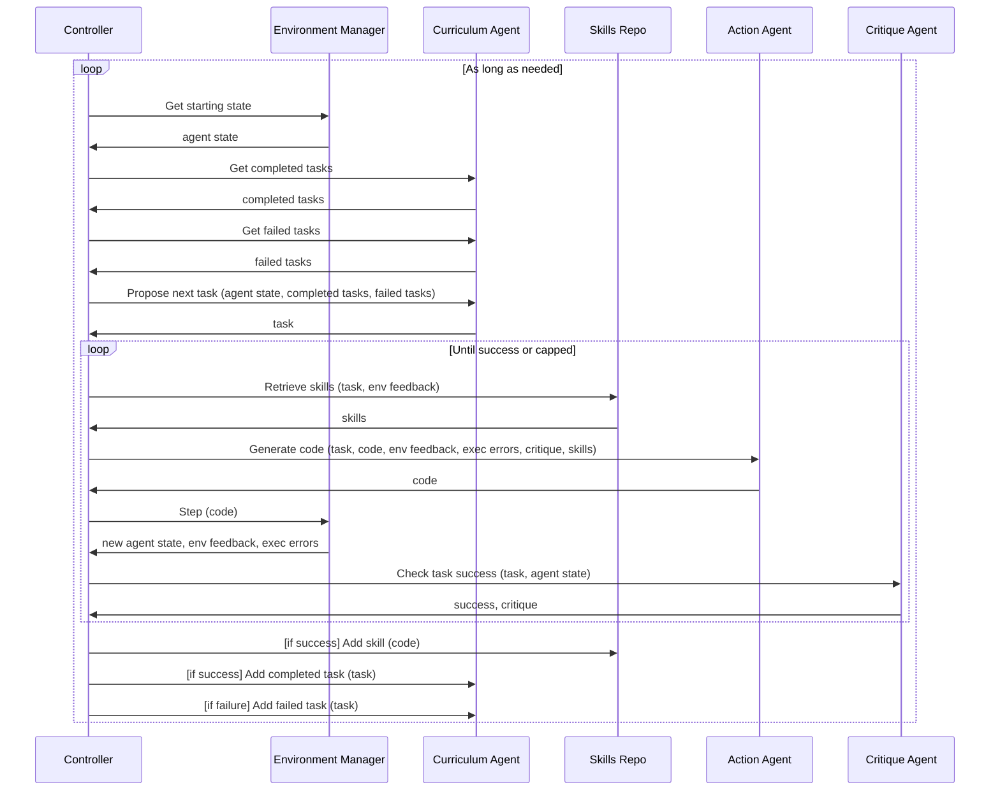

# Voyager

Original [paper](https://arxiv.org/pdf/2305.16291.pdf).

## Sequence Diagram

```mermaid
sequenceDiagram

    loop As long as needed
        Controller->>Environment Manager: Get starting state
        Environment Manager->>Controller: agent state

        Controller->>Curriculum Agent: Get completed tasks
        Curriculum Agent->>Controller: completed tasks

        Controller->>Curriculum Agent: Get failed tasks
        Curriculum Agent->>Controller: failed tasks

        Controller->>Curriculum Agent: Propose next task (agent state, completed tasks, failed tasks)
        Curriculum Agent->>Controller: task

        loop Until success or capped
            Controller->>Skills Repo: Retrieve skills (task, env feedback)
            Skills Repo->>Controller: skills

            Controller->>Action Agent: Generate code (task, code, env feedback, exec errors, critique, skills)
            Action Agent->>Controller: code

            Controller->>Environment Manager: Step (code)
            Environment Manager->>Controller: new agent state, env feedback, exec errors

            Controller->>Critique Agent: Check task success (task, agent state)
            Critique Agent->>Controller: success, critique
        end

        Controller->>Skills Repo: [if success] Add skill (code)
        Controller->>Curriculum Agent: [if success] Add completed task (task)
        Controller->>Curriculum Agent: [if failure] Add failed task (task)
    end
```
